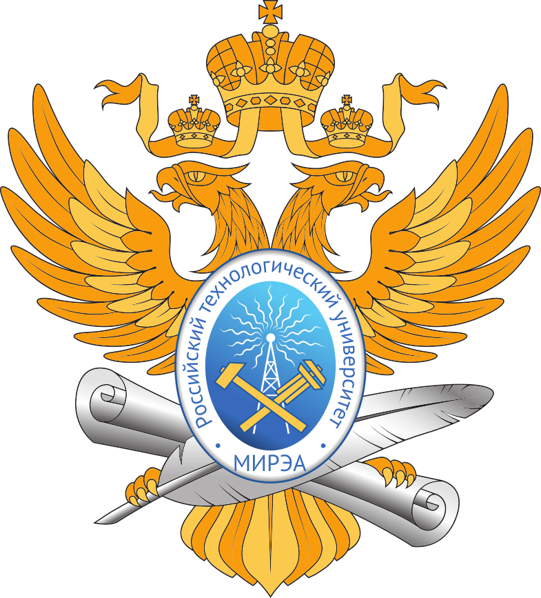

  

___

# Программирование корпоративных систем
Дисциплина: **Программирование корпоративных систем**  
Семестр: 5  
Работы выполнил студент **ЭФБО-01-22 Сейранян С.Г.  

# Структура репозитория
| Номер Практики | Ссылка на ветку |
|:---:|---|
| 1 | |
| 2 | |
| 3 | |
| 4 | |
| 5 | |
| 6 | [Ссылка на ветку](https://github.com/Livmasss/flutter_tasks/tree/Practice_6) |
| 7 | [Ссылка на ветку](https://github.com/Livmasss/flutter_tasks/tree/Practice_7) |
| 8 | [Ссылка на ветку](https://github.com/Livmasss/flutter_tasks/tree/Practice_8) |
| 9 | [Ссылка на ветку](https://github.com/Livmasss/flutter_tasks/tree/Practice_9) |
| 10 | [Ссылка на ветку](https://github.com/Livmasss/flutter_tasks/tree/Practice_10) |
| 11 | [Ссылка на ветку](https://github.com/Livmasss/flutter_tasks/tree/Practice_11) |
| 12 | [Ссылка на ветку](https://github.com/Livmasss/flutter_tasks/tree/Practice_12) |
| 13 | [Ссылка на ветку](https://github.com/Livmasss/flutter_tasks/tree/Practice_13) |
| 14 | [Ссылка на ветку](https://github.com/Livmasss/flutter_tasks/tree/Practice_14) |
| 15 | [Ссылка на ветку](https://github.com/Livmasss/flutter_tasks/tree/Practice_14) |
| 16 | [Ссылка на ветку](https://github.com/Livmasss/flutter_tasks/tree/Practice_16) |
